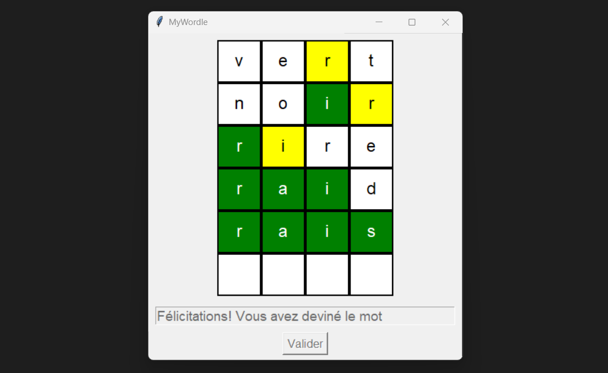

## Problème des NReines


## Description:
Ce projet met en œuvre une solution au problème des N reines (la valeur par défaut est 10) à l'aide d'OCaml.

L'objectif est de placer N reines sur un échiquier NxN de manière à ce qu'aucune reine ne menace une autre reine, c'est-à-dire qu'aucune reine ne partage la même ligne, colonne ou diagonale qu'une autre reine.

L'algorithme utilise la récursivité et le backtracking pour explorer les configurations possibles jusqu'à ce qu'une solution valide soit trouvée.

## Fonctionnement 
- Représentation des positions sur l'échiquier sous forme de paires de coordonnées (x, y)
- Détection des conflits entre les reines (même ligne, colonne ou diagonale)
- Placement récursif des reines avec une approche backtracking
- Affichage de la solution finale sur l'échiquier dans le terminal

## Prérequis
OCaml 

## Installation et exécution 
1. Cloner le dépôt:
``` powershell
git clone <url-du-repo>
cd <nom-du-repo>
```

2. Compiler et exécuter le fichier
```powershell 
ocamlc -o nreines Nreines.ml 
.\nreines
```

