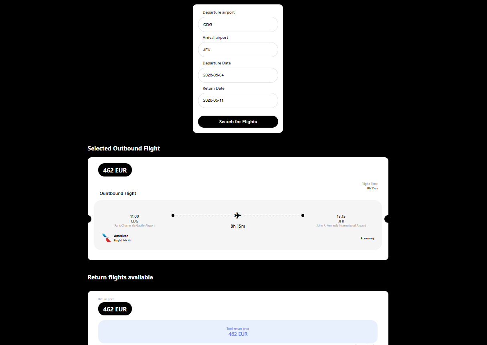

# Comparaison des Vols



## Description
Une application Flask minimale pour comparer et réserver des vols en s'appuyant sur l'API SerpApi (moteur `google_flights`). 

Le serveur expose des endpoints POST simples (/search, /search-return, /book) qui acceptent des paramètres de recherche (aéroports, dates, tokens) et renvoient le JSON brut fourni par SerpApi. 

L'interface utilisateur est un template HTML/CSS qui envoie les requêtes et affiche les résultats.

## Fonctionnalités principales
- Recherche multi-critères : origine, destination et dates.
- Affichage et comparaison côte à côte des offres (prix, durée, escales, compagnies).
- Tri : meilleur prix, plus rapide, meilleur rapport qualité/prix.
- Recherche aller/retour avec gestion de token de départ (`departure_token`) pour lier les segments.
- Récupération d'un `booking_token` et tentative de récupération des détails de réservation via l'API.

## Technologies
- Python : logique serveur (Flask) — gestion des endpoints, validation des paramètres, appels à l'API SerpApi, traitement/normalisation du JSON, gestion des tokens (departure/booking), gestion des erreurs et mise en cache.
- HTML / CSS : interface utilisateur.

## Prérequis 
- Python: 3.13
- Clé API: Créer un compte sur SerpApi et obtenir la clé
- Navigateur pour l'interface web. 

## Installation et exécution

1. Cloner le dépôt:
``` powershell
git clone <url-du-repo>
cd <nom-du-repo>
```

2. Créer un environnement virtuel puis l'activer :
```powershell
python -m venv .venv
.\.venv\Scripts\Activate.ps1
```

3. Installer les dépendances nécessaires:
```powershell
pip install flask serpapi
```

4. Changer votre clé API:
```powershell
API_KEY = "your-api-key"
```

5. Lancer l'application :
```powershell
python app.py
```

L'application écoute par défaut sur http://127.0.0.1:5000/
